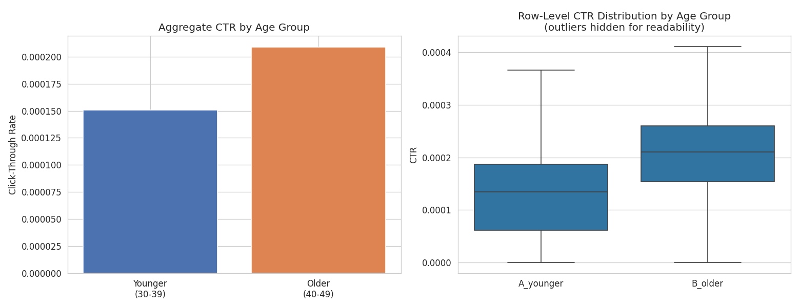

# Ad Campaign A/B Test — Age Group Targeting & Click-Through Rate

**Author:** Samuel Adegboyega
**Tools:** Python, Pandas, NumPy, SciPy, statsmodels, Matplotlib, Seaborn
**Dataset:** [Clicks Conversion Tracking — Kaggle](https://www.kaggle.com/datasets/loveall/clicks-conversion-tracking) — real Facebook ad campaign data, 1,143 ads across 3 campaigns

---

## Problem Statement

This project treats real Facebook ad campaign data as an A/B/n comparison across age-group targeting, asking: **does targeting a younger audience (30-39) produce a different click-through rate than targeting an older audience (40-49), and which group is actually more cost-efficient?**

This complements my Recommendation Ranking A/B Test project, which uses simulated data to demonstrate the statistical methodology cleanly. This project instead uses real recorded data  with unequal group sizes, no controlled randomization, and outlier ads with very high impression counts  to show the same methodology applied to messier, real-world conditions

**Business Questions:**
- Is there a statistically significant CTR difference between age groups?
- How large is the difference, and does it matter practically?
- Which group is more cost-efficient per click and per conversion?
- What should a media buyer actually do with this result?

---

## Approach

1. **Data cleaning & feature engineering** — computed row-level CTR and cost-per-click; grouped the four age bands into two comparison groups (30-39 vs 40-49) matching how the campaigns were actually targeted.
2. **Exploratory analysis** — aggregate impressions, clicks, spend, and conversions per group.
3. **Hypothesis testing** — two-proportion Z-test on aggregated clicks/impressions (aggregating first, rather than averaging row-level CTRs, avoids letting small low-impression ads distort the comparison).
4. **Confidence interval** on the CTR difference.
5. **Cost-efficiency check** — CPC and cost-per-conversion, since a higher-CTR group isn't automatically the better investment.

---

## Results

| Metric | Younger (30-39) | Older (40-49) |
|---|---|---|
| Ads | 674 | 469 |
| CTR | 0.0151% | 0.0209% |
| Cost per click | $1.59 | $1.50 |
| Cost per conversion | **$12.82** | **$26.79** |

- **Z-statistic:** -31.86, **p-value:** < 0.0001 — the CTR difference is statistically significant (the large sample size makes even a small absolute difference easy to detect).
- **95% CI on the difference:** [-0.00006, -0.00005] — a precise, consistently negative interval.
- The older group has a **higher CTR**, but the younger group converts **more than twice as efficiently** per dollar spent.



---

## Key Insight

This is a case where statistical significance alone would point the wrong way. If you only looked at CTR, you'd shift budget toward the older age group. But CTR measures clicks, not outcomes  and the younger group's cost-per-conversion is less than half the older group's. **A click isn't a conversion**, and this dataset shows exactly why that distinction matters before making a budget decision.

---

## Recommendation

Don't reallocate budget on CTR alone. The younger group is the more cost-efficient segment for driving actual conversions, despite its lower CTR  worth prioritizing it for spend, while separately investigating why older-audience clicks convert at a much lower rate (landing page mismatch, offer relevance, or funnel drop-off are the usual suspects).

**Caveat:** this is observational campaign data, not a randomized controlled experiment — age groups weren't randomly assigned under identical conditions, so this shows association, not proof that age *causes* the difference. A real randomized test would be needed before treating this as causal.

---

## How to Run

```
# 1. Clone the repository
git clone https://github.com/Hydrosamueldc/ad-campaign-ab-test.git
cd ad-campaign-ab-test

# 2. Install dependencies
pip install pandas numpy scipy statsmodels matplotlib seaborn jupyter

# 3. Run the notebook
jupyter notebook ad_campaign_ab_test.ipynb
```

---

## Business Relevance

This mirrors real media-buying and growth analytics work: testing whether an audience or creative change actually moves a metric, checking significance rather than eyeballing it, and  critically checking whether the metric that moved is the one that actually matters for the business. The same framework applies directly to testing recommendation or ranking changes on a content platform, where click-through rate and downstream engagement can move in different directions.

---
*Samuel Adegboyega | [LinkedIn](https://linkedin.com/in/adegboyega-samuel-1a302b203)*

**Data attribution:** dataset originally published on Kaggle as "Clicks Conversion Tracking" by Karan Mahant (loveall).
